# Automatisch analyse rapport

_Gegenereerd op: 2025-12-07 14:04:19_

## Inleiding

Lorem ipsum dolor sit amet, consectetur adipiscing elit. Vivamus et lacus eget enim suscipit porttitor sed non felis. Donec auctor, massa tincidunt mattis ornare, sapien quam auctor mauris, sed iaculis tellus tellus nec diam. Nunc ut gravida sem. Sed feugiat enim commodo, pellentesque nisl eget, pulvinar metus. Morbi non elit ac sem imperdiet pellentesque. Etiam congue justo quis nibh varius, vitae ultrices nisi condimentum. Mauris pharetra, tortor sit amet dignissim scelerisque, ante ex consequat magna, a gravida felis justo a libero. Mauris ullamcorper vestibulum nibh, in egestas elit scelerisque a. Etiam tempus aliquam ipsum eget tempus.

## Resultaten

### Grafieken

Volgende grafieken werden automatisch gegenereerd met de geproceste data.

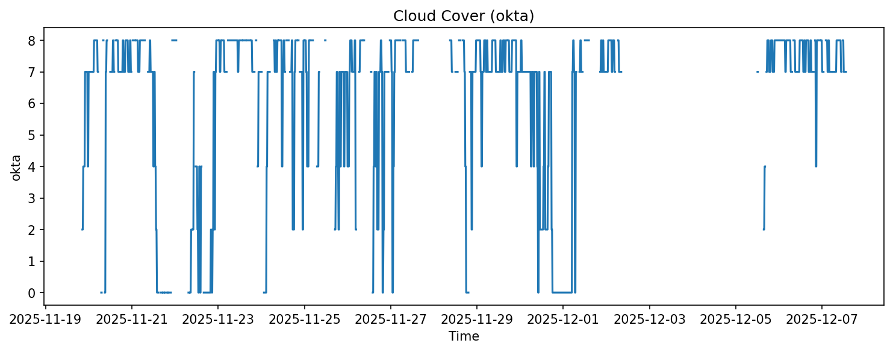

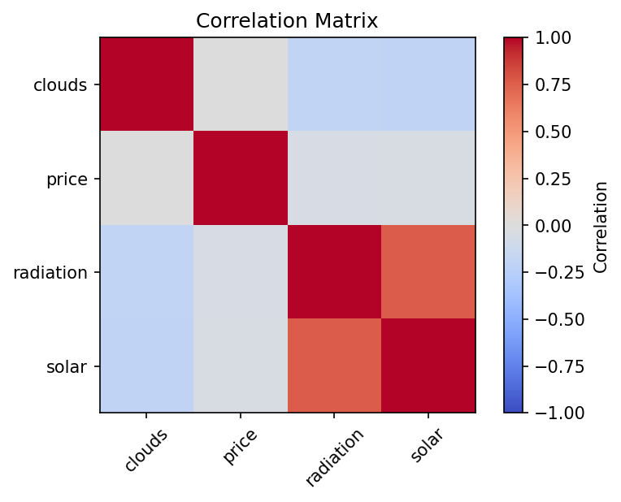

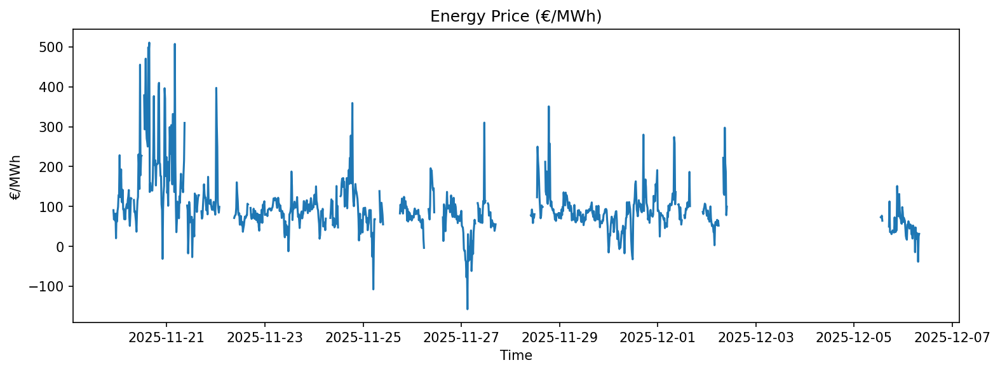

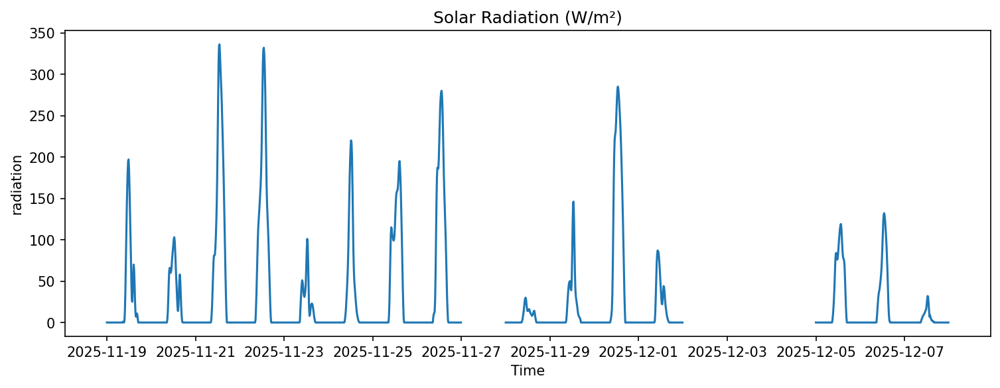

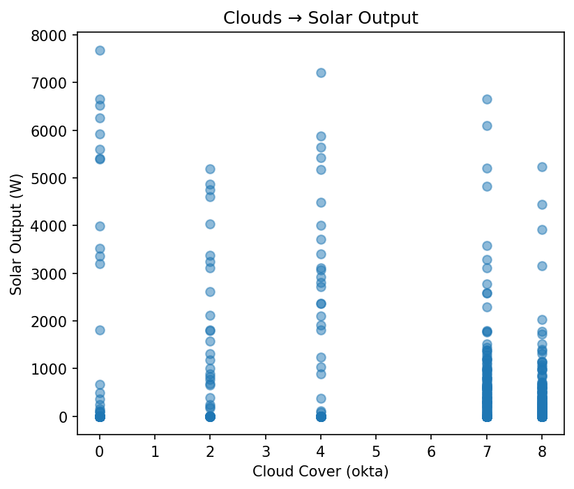

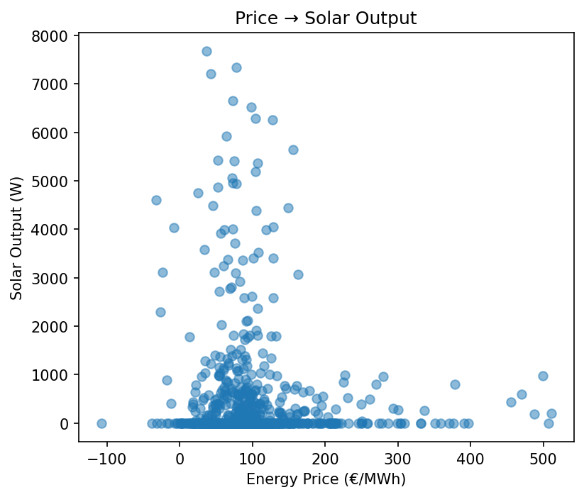

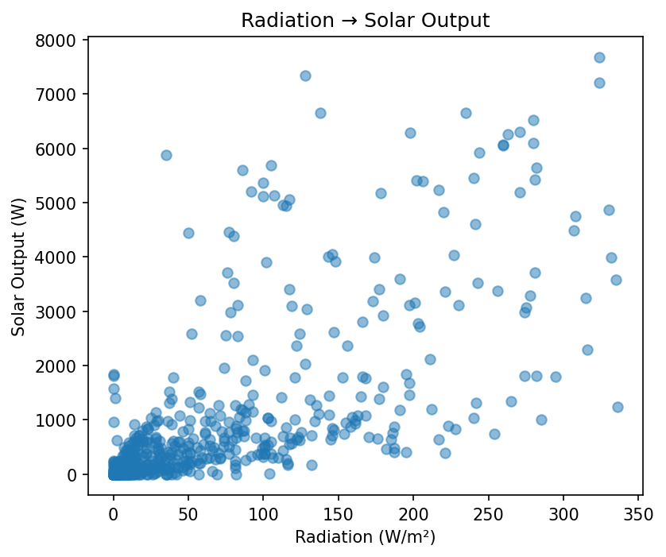

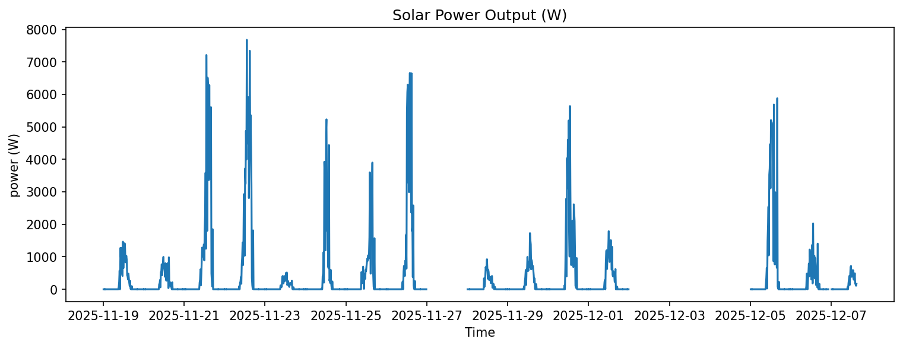

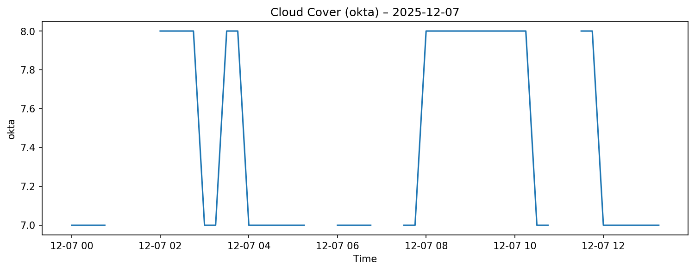

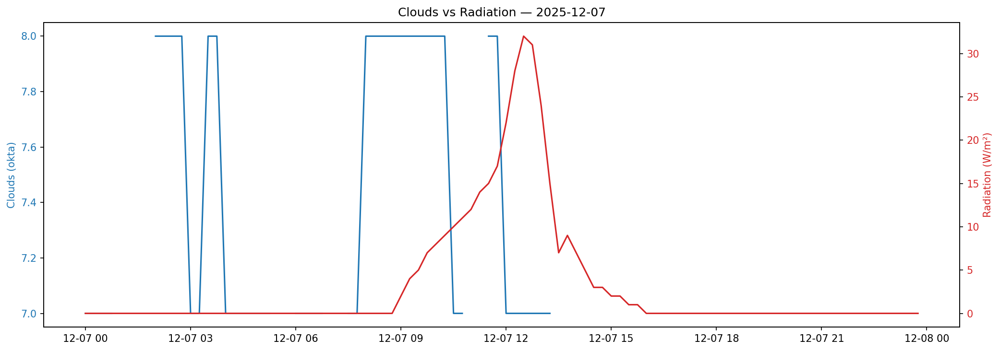

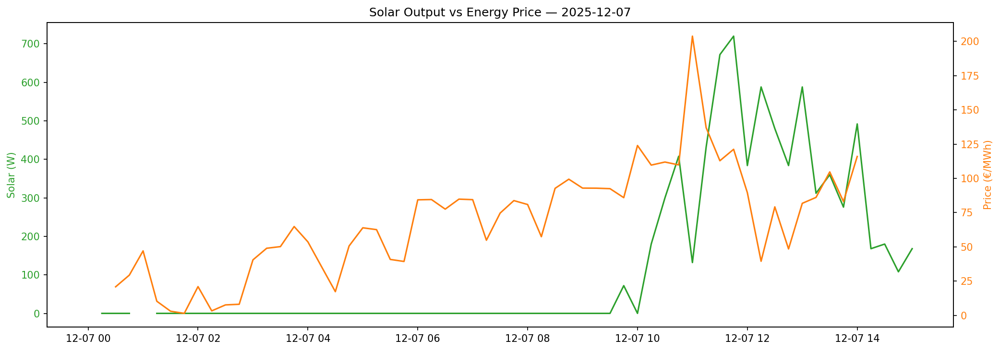

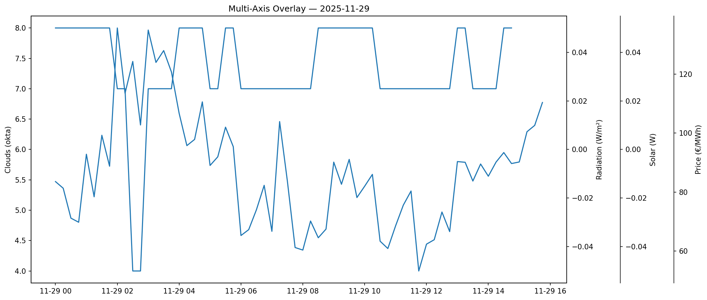

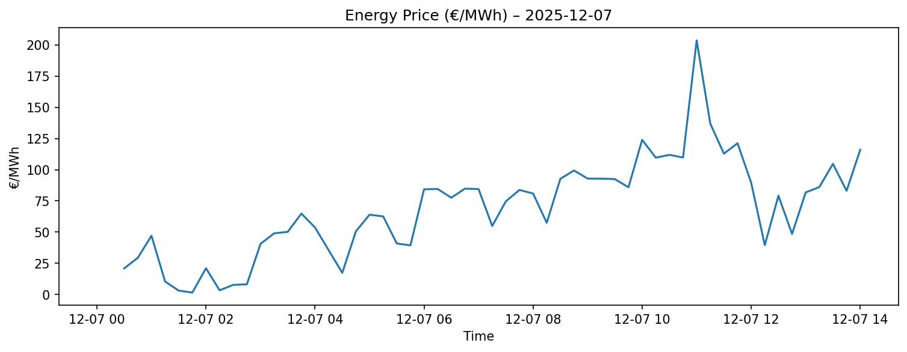

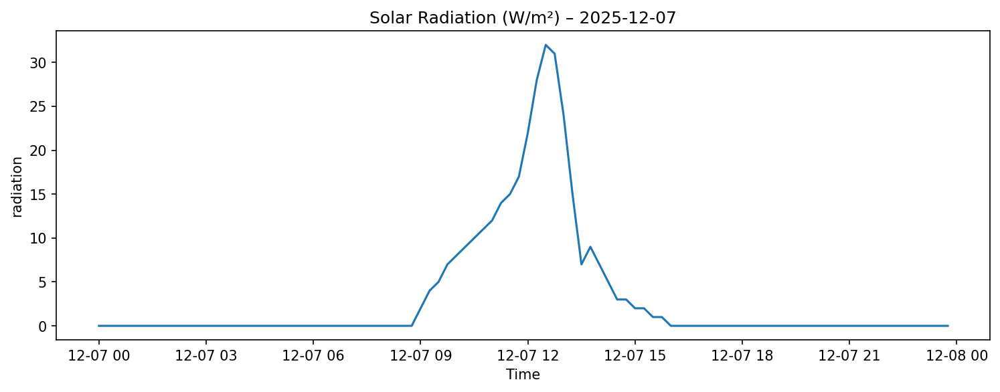

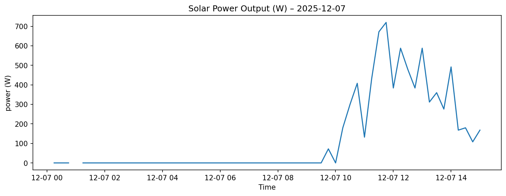

### Tabel

In onderstaande tabel wordt de geproceste data die de laatste 24u verzameld werd weergegeven.

|Timestamp|Clouds(okta)|Price|Radiation|Solar|
|---|---|---|---|---|
|2025-12-07T00:30|7|20.857076923076928|0.0|0|
|2025-12-07T00:45|7|29.395666666666667|0.0|0|
|2025-12-07T02:00|8|20.998133333333335|0.0|0|
|2025-12-07T02:15|8|3.2984|0.0|0|
|2025-12-07T02:30|8|7.65|0.0|0|
|2025-12-07T02:45|8|8.1092|0.0|0|
|2025-12-07T03:00|7|40.530133333333325|0.0|0|
|2025-12-07T03:15|7|49|0.0|0|
|2025-12-07T03:30|8|50.20769230769231|0.0|0|
|2025-12-07T03:45|8|64.8516|0.0|0|
|2025-12-07T04:00|7|53.6768|0.0|0|
|2025-12-07T04:15|7|35.47225|0.0|0|
|2025-12-07T04:30|7|17.32|0.0|0|
|2025-12-07T04:45|7|50.66393333333334|0.0|0|
|2025-12-07T05:00|7|63.9368|0.0|0|
|2025-12-07T05:15|7|62.59046666666667|0.0|0|
|2025-12-07T06:00|7|84.35333333333334|0.0|0|
|2025-12-07T06:15|7|84.56393333333334|0.0|0|
|2025-12-07T06:30|7|77.56773333333334|0.0|0|
|2025-12-07T06:45|7|84.85886666666669|0.0|0|
|2025-12-07T07:30|7|74.68473333333331|0.0|0|
|2025-12-07T07:45|7|83.78799999999998|0.0|0|
|2025-12-07T08:00|8|80.93500000000002|0.0|0|
|2025-12-07T08:15|8|57.45246666666667|0.0|0|
|2025-12-07T08:30|8|92.7326|0.0|0|
|2025-12-07T08:45|8|99.42000000000002|0.0|0|
|2025-12-07T09:00|8|92.90999999999998|2.0|0|
|2025-12-07T09:15|8|92.85866666666668|4.0|0|
|2025-12-07T09:30|8|92.50200000000001|5.0|0|
|2025-12-07T09:45|8|85.95026666666668|7.0|72|
|2025-12-07T10:00|8|124.0184|8.0|0|
|2025-12-07T10:15|8|109.7018|9.0|180|
|2025-12-07T10:30|7|111.94720000000001|10.0|300|
|2025-12-07T10:45|7|109.8412666666667|11.0|408|
|2025-12-07T11:30|8|112.89046666666665|15.0|672|
|2025-12-07T11:45|8|121.23966666666665|17.0|720|
|2025-12-07T12:00|7|89.58600000000001|22.0|384|
|2025-12-07T12:15|7|39.51486666666666|28.0|588|
|2025-12-07T12:30|7|79.20006666666667|32.0|480|
|2025-12-07T12:45|7|48.509933333333336|31.0|384|
|2025-12-07T13:00|7|81.79611111111112|24.0|588|
|2025-12-07T13:15|7|86.12146666666666|15.0|312|

## Conclusie

Lorem ipsum dolor sit amet, consectetur adipiscing elit. Etiam dui felis, pulvinar non eros porta, laoreet iaculis nulla. Curabitur eu viverra elit. Aliquam erat volutpat. Praesent et est vitae mi volutpat porta. Donec faucibus, nibh nec pretium rutrum, mi leo fringilla ante, at ultricies nunc nisl at augue. Aliquam at cursus libero, a ultrices augue. Nulla sed dignissim ante, vel tristique massa. Nulla nec magna velit. Duis auctor porttitor nibh, et placerat dolor molestie sed. Praesent nec lobortis mauris, non interdum ante. Donec nec urna eu erat sagittis suscipit et ut metus. Nam volutpat ex in ante pellentesque, nec dignissim nunc porta. Praesent pellentesque porttitor urna, vitae eleifend justo dignissim eget. Praesent volutpat nisi congue ipsum mollis pulvinar. Integer sollicitudin dolor quis nisl hendrerit, ut commodo odio venenatis. In hac habitasse platea dictumst.

